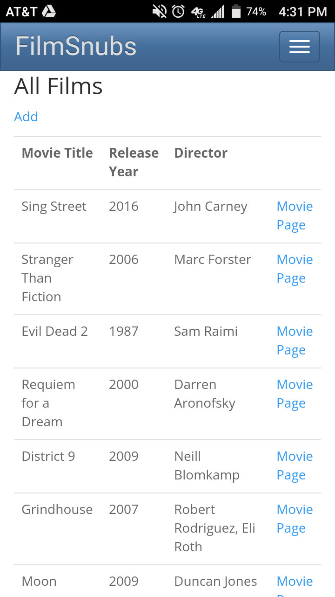

##MovieReviews
FilmSnubs is a an ASP.NET MVC Web Application for compiling 'underrated' films, with search functionality and review postings for users stored with Microsoft SQL Server. The application allows users to find and share under-rated movies, and review them as well. 

[Live](http://filmsnubs.apphb.com/home)


##Code-First Migrations and Entity Framework
I used Entity Framework's code-first migration system for the database-ORM, which helps persist data while models can be a but more fluid. Data annotations written in the model view help provide most of the information needed to generate a fairly accurate migration. 

```C#
        [Key]
        public int Id { get; set; }
        [Required]
        [StringLength(40, ErrorMessage="Movie Title can only be 40 characters")]
        [Display(Name = "Movie Title")]
        [RegularExpression(@"^\d+{4}$", ErrorMessage = "Must be a valid year")]
        public string Title { get; set; }
        [Display(Name = "Release Year")]
        public string year { get; set; }
        public string Director { get; set; }
        public ICollection<Review> Reviews { get; set; }
 ```
Entity also allows for easy `one-to-many` associatons and lazy loading through the use of virtual properties in the model. Additional database properties were written with Transact-SQL to assure proper handling of data modification and deletion among other things. 



###JavaScript For Sorting Data
Due to the minimal frontend logic in this project, I chose to avoid making server requests to organize data. Instead I wrote a script to re-order the DOM elements within table based on alphanumeric order. 

##Razor Markup
`C# Razor` allowed me to handle some basic logic in my views. I would rather have integrated a light frontend framework to handle the data, but since this was a short project for my review purposes using razor was adequate. I would love to integrate `.NET` and `Reactjs.net` or `Angularjs` in a future project. 

##Queries in Visual C-Sharp
I enjoy writing SQL queries probably more than the average programmer, so I appreciate the several options Visual C# provides in the form of `Command Objects`, `Table Adapters`, and `LINQ Operations`. 
```C#
            if (User.Identity.IsAuthenticated)
            {
                var currentId = User.Identity.GetUserId();
                var userReviews = from r in db.Review where r.ApplicationUserId == currentId select r;
                var withMovie = userReviews.Include(r => r.Movie);
                return View(withMovie.ToList());
            }
  ```
While the application in its current state does require very complicated queries, ASP.NET makes it quite easy to write queries that read like SQL in your source code, allowing for more complex logic when needed. 

##Frontend
Speaking of the frontend, that is one thing I would like to revisit later for this project. As of now it is very minimal, with mostly HTML/CSS and a bit of jQuery to handle data re-organization. I just enjoy the limitless opportunities to integrate different technologies and find new development experiences all the time. 
